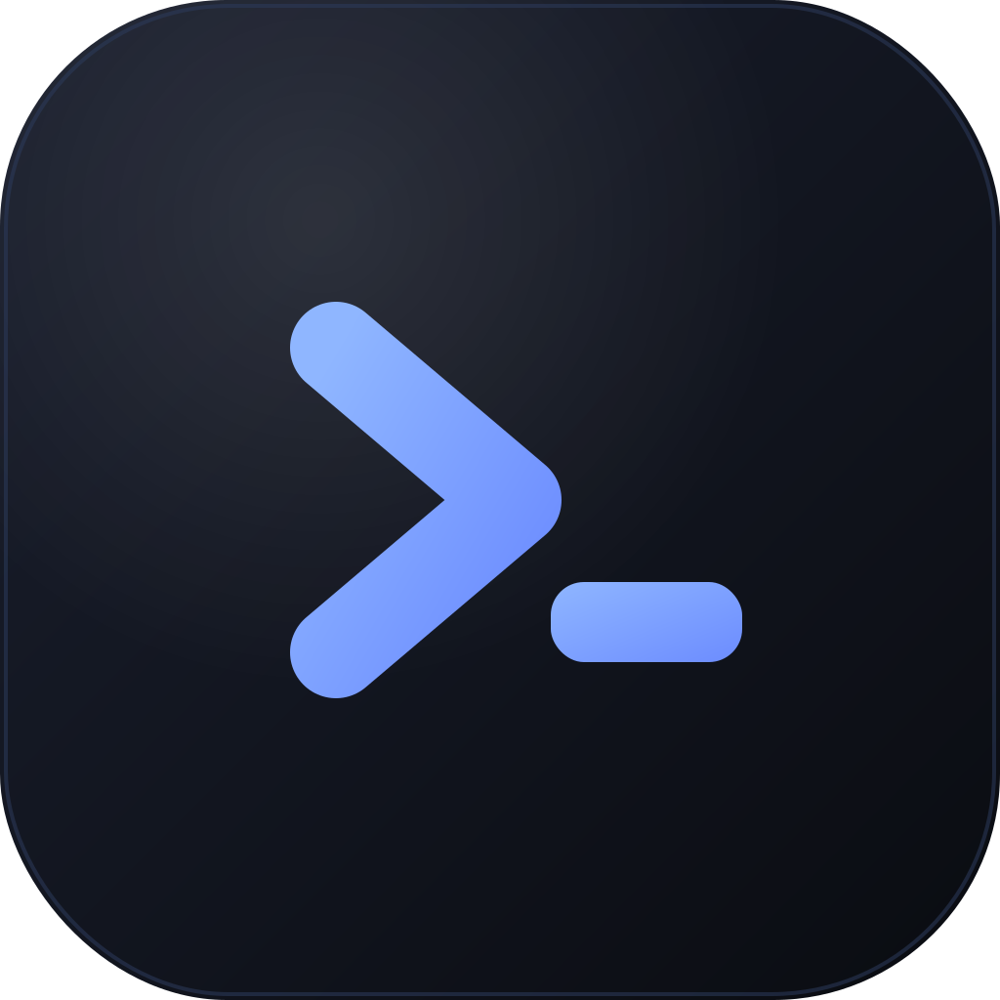

<p align="center"></p>

# CmdrZone — Project Command Center

[](https://github.com/Innoveramera/cmdrzone/actions/workflows/ci.yml)
[](LICENSE)

A macOS-first desktop "command center" for developers who juggle many projects and AI coding
agents. It replaces a messy wall of iTerm tabs with a single window: a live tree of every project
under a folder you choose (e.g. `~/Development`), and a per-project workspace with embedded
**Claude Code** (or other CLI agent) terminals, a code editor, git status, and more — designed so
you can never prompt the wrong project.

> Status: early but functional. Built in the open — issues and PRs welcome.

<!-- Add a screenshot at docs/screenshot.png -->


## Why

Running 5+ projects, each with its own Claude Code session in a separate terminal tab, gets messy
fast — wrong-tab prompts, no overview, lost sessions. CmdrZone gives you one place to see and
drive them all.

## Features

- **Project tree** from a root folder you pick — projects + monorepo sub-projects, with
  pinned/favorites, a stable per-project color, git dirty count, and live agent/session indicators.
- **Embedded agent terminals** — launch Claude Code (default) or Aider / Codex / Gemini / opencode
  per project, in real PTYs with your full login-shell PATH. Resume the last Claude conversation in
  one click (`claude --continue`).
- **Code editor** — a Files + **Monaco** (VS Code's editor) tab with multi-file tabs, IntelliSense,
  minimap, and save.
- **Project info** — README / CLAUDE.md / TASKS.md preview, `package.json` scripts as one-click run
  buttons, git status, dev-server **port detection** (open in browser), `.env` presence.
- **Agent awareness** — per-project status (working / waiting / done / error), an agent activity
  rail, and native notifications when an agent needs you or finishes.
- **Keyboard-first** — `⌘K` fuzzy switcher, `⌘0` dashboard, `⌘1–9` pinned projects, `⌘T` new
  terminal, `⌘D` / `⌘⇧D` split pane.
- **Split terminals** — split any tab into panes (row/col); each pane is its own live PTY.
- **Model-agnostic, Claude-first** — agents are just launch recipes; add your own.

## Stack

Electron · electron-vite · React + TypeScript · node-pty + xterm.js · Monaco Editor ·
better-sqlite3 · pnpm workspace.

## Requirements

- macOS (Windows / Linux not yet supported)
- Node.js ≥ 20 and pnpm ≥ 10
- Xcode Command Line Tools (to compile the native modules)

## Quick start

```bash
git clone https://github.com/Innoveramera/cmdrzone.git
cd cmdrzone
pnpm install          # installs deps + downloads Electron
pnpm rebuild:native   # IMPORTANT: rebuild node-pty + better-sqlite3 for Electron's ABI
pnpm dev              # launch with hot reload
```

> **Heads-up:** run `pnpm rebuild:native` after every `pnpm install`. pnpm 10 + Electron require the
> native modules (node-pty, better-sqlite3) compiled against Electron's ABI; this is wired in
> `scripts/rebuild-native.mjs`. If you hit a `NODE_MODULE_VERSION` mismatch, that's the fix.

Build / package:

```bash
pnpm build            # build main + preload + renderer
pnpm dist             # package a macOS DMG (ad-hoc signed by default)
```

For a distributable signed/notarized DMG, set your Apple Developer ID in
`apps/desktop/electron-builder.yml` and provide notarization credentials.

## Architecture

```
apps/desktop/src/
  shared/    # framework-agnostic types + typed IPC contracts (no electron / node)
  core/      # domain logic: env (login-shell PATH), project scanner, agents, persistence, fs
  pty/       # node-pty session manager (runs in the PTY-host utilityProcess)
  main/      # electron main process + pty-host entry
  preload/   # contextBridge surface
  renderer/  # React UI (Zustand store, xterm, CodeMirror)
```

`core` / `pty` / `shared` import nothing from Electron, so they stay portable. See
[CONTRIBUTING.md](CONTRIBUTING.md) for dev details and headless smoke checks.

## Roadmap

- Durable sessions (tmux-backed) — quit the app and agents keep running, reattach later
- Vercel deploy status; richer dev-server detection
- Windows support

## Contributing

Issues and PRs welcome — see [CONTRIBUTING.md](CONTRIBUTING.md) and the
[Code of Conduct](CODE_OF_CONDUCT.md).

## License

[GPL-3.0-or-later](LICENSE) © Fredrik Hammarström
